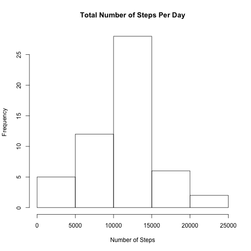
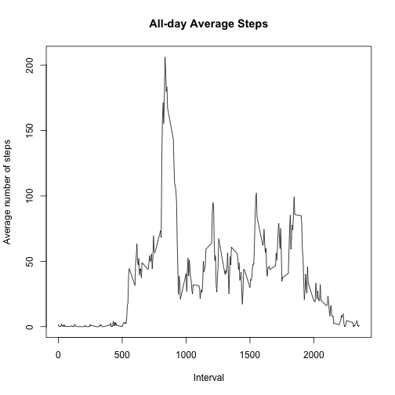
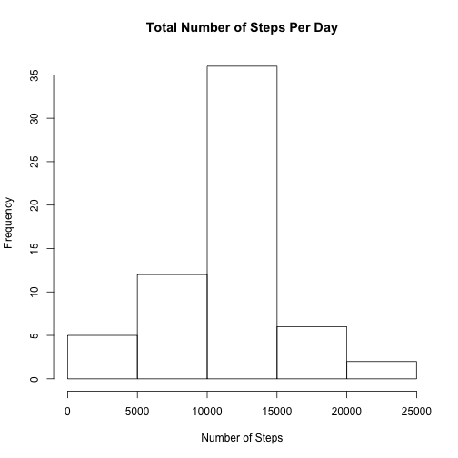
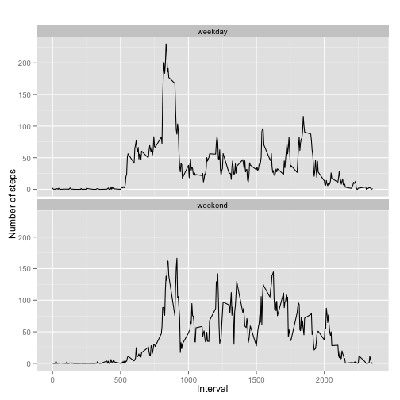

## Loading and preprocessing the data


There are 2 libraries that I used in this analysis:

```r
## Include Library
library(ggplot2)
library(knitr)
```

As the package came in .zip format, I put a code to unzip it, and eventually reading the data and put it in a dataframe.

```r
## Unzip File
unzip ("activity.zip", exdir = "./")

## Read File
data_activity <- read.csv("activity.csv")
data_activity <- data_activity[c("date", "steps", "interval")]

## Removing NA Values
data_activity <- data_activity[complete.cases(data_activity),]
```


## What is mean total number of steps taken per day?

In order to Calculate the total number of steps taken per day, I used the aggregate function.

```r
data_agg <- aggregate(data_activity$steps, by = list(data_activity$date), sum)
names(data_agg) <- c("date", "steps")
head(data_agg)
```

```
##         date steps
## 1 2012-10-02   126
## 2 2012-10-03 11352
## 3 2012-10-04 12116
## 4 2012-10-05 13294
## 5 2012-10-06 15420
## 6 2012-10-07 11015
```


Then I plot a histogram here:

```r
hist(data_agg$steps, xlab = "Number of Steps", main = "Total Number of Steps Per Day")
```

 

By using summary() as shown below:

```r
summary(data_agg)
```

```
##          date        steps      
##  2012-10-02: 1   Min.   :   41  
##  2012-10-03: 1   1st Qu.: 8841  
##  2012-10-04: 1   Median :10765  
##  2012-10-05: 1   Mean   :10766  
##  2012-10-06: 1   3rd Qu.:13294  
##  2012-10-07: 1   Max.   :21194  
##  (Other)   :47
```
We get that the median is 10765 and the mean is 10766.


## What is the average daily activity pattern?

I made a time series plot of the 5-minute interval (x-axis) and the average number of steps taken, averaged across all days (y-axis).

```r
interval_agg <- aggregate(steps ~ interval, data_activity, mean)
plot(interval_agg$interval, interval_agg$steps, type='l', main="All-day Average Steps", xlab="Interval", ylab="Average number of steps")
```

 

In order to figure out which interval has the most step, I called the row index where the most step value lies.

```r
interval_agg[which.max(interval_agg$steps),]
```

```
##     interval    steps
## 104      835 206.1698
```
We can see that interval 835 has the maximum number of steps.

## Imputing missing values

The presence of missing days may introduce bias into some calculations or summaries of the data.

By running the code here:

```r
imputed <- read.csv("activity.csv")
sum(!complete.cases(imputed))
```

```
## [1] 2304
```
We get that there are 2304 incomplete cases.

To complete the data, I used the mean for that 5-minute interval to replace the missing values with the following code:

```r
for (i in 1:nrow(imputed)){
    if (is.na(imputed$steps[i])) {
        take_interval <- imputed$interval[i]
        take_steps <- interval_agg[interval_agg$interval == take_interval,]
        imputed$steps[i] <- take_steps$steps
    }
}
```
It worked by scanning the whole dataframe, detecting missing values, and replacing them with the mean of the same interval from the other data.

To find the mean and the median of the imputed data frame, I used the code similar to the first draw:

```r
## Start by aggregating
imputed_agg <- aggregate(imputed$steps, by = list(imputed$date), sum)
names(imputed_agg) <- c("date", "steps")

## Draw Histogram
hist(imputed_agg$steps, xlab = "Number of Steps", main = "Total Number of Steps Per Day")
```

 

```r
## Creating the Summary
summary(imputed_agg)
```

```
##          date        steps      
##  2012-10-01: 1   Min.   :   41  
##  2012-10-02: 1   1st Qu.: 9819  
##  2012-10-03: 1   Median :10766  
##  2012-10-04: 1   Mean   :10766  
##  2012-10-05: 1   3rd Qu.:12811  
##  2012-10-06: 1   Max.   :21194  
##  (Other)   :55
```
The first data has mean and median of 10765 and 10766, respectively, while the imputed data has mean and median of 10766 and 10766 respectively. It does show a slight change on the value i.e. the increase in median.


## Are there differences in activity patterns between weekdays and weekends?

To answer this question, we must first make the factor to distinguish which data belongs to weekday or weekend.

```r
## Starting by adding additional column for flag
imputed['Type'] <- weekdays(as.Date(imputed$date))
imputed$Type[imputed$Type  %in% c('Saturday','Sunday') ] <- "weekend"
imputed$Type[imputed$Type != "weekend"] <- "weekday"

## And aggregate it
imputed$Type <- as.factor(imputed$Type)
imputed_type_agg <- aggregate(steps ~ interval + Type, imputed, mean)

## Finally, plot it for better understanding
qplot(data = imputed_type_agg, interval, steps, type = 'l', geom=c("line"), xlab = "Interval", ylab = "Number of steps", main = "") + facet_wrap(~ Type, ncol = 1)
```

 


The answer is yes, there is a noticable difference in the activity, where during weekday, there is a higher spike on the inverval around 835.

